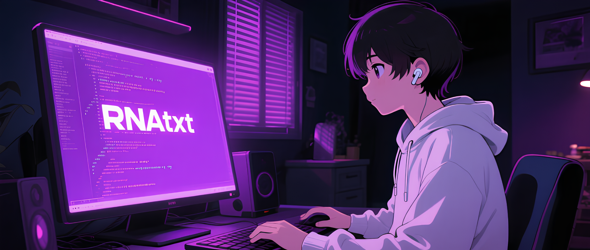

## WELCOME TO MY GITHUB </>

### 
 _For Revenge🤙_ 

 ━━━━━━━━●── 

⇆ㅤ◁ㅤ❚❚ㅤ▷ㅤ↻ 

### || tech stack (^ _ ^)

  

 

### || follow my social media (●'◡'●)

###  [IG {\^o^}](https://www.instagram.com/reveiras?igsh=Nm5xb3J3MDZjOWtn)

### || I can do it 🧐
##### 🍀 *designing your github profile (custom)*
##### 🌐 *create a website*
##### 🔰 *create a arduino program*

<picture>
  <source media="(prefers-color-scheme: dark)" srcset="https://raw.githubusercontent.com/RNAtxt/RNAtxt/output/pacman-contribution-graph-dark.svg">
  <source media="(prefers-color-scheme: light)" srcset="https://raw.githubusercontent.com/RNAtxt/RNAtxt/output/pacman-contribution-graph.svg">
  
</picture>

###

